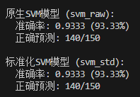

# 任务报告（本文档纯手打，未经ai任何形式的辅助）

## 完成任务流程阐明

### 1. 创建项目目录并初始化虚拟环境
```
cd task1
uv init
uv add torch pandas numpy matplotlib
```
###### 生成了.gitignore / README.md / main.py / project.toml / uv.lock 等文件。

### 2. 阅读资料👓

[神经网络——最易懂最清晰的一篇文章](https://blog.csdn.net/illikang/article/details/82019945)

[【数之道】支持向量机SVM是什么，八分钟直觉理解其本质](https://www.bilibili.com/video/BV16T4y1y7qj/)

[挑战只用17分钟讲完所有的机器学习模型！](https://www.bilibili.com/video/BV1GgkSYBEpD/?vd_source=0649962d40ba591bdda6fdbf1ef2e820)


### 3. ai辅助设计提示词（使用豆包多模态支持）
#### [豆包完整对话](https://www.doubao.com/thread/wfd72a619e3f57d64)

###### 期间迭代过几次，以保证这份提示词能够一次过（如uv管理限定、中文限定、输出规范等）

#### [最终提示词](./res/prompt.md)

### 4. 生成最终代码说明
###### 代码由claude code一次性生成，无人监管
#### 任务2
- [1_draw.py](./1_draw.py)
    - 绘制train.csv数据集

- [1_train.py](./1_train.py)
    - 训练两个SVM模型

- [1_test.py](./1_test.py)
    - 测试两个SVM模型的准确率

- [1_drawSVM.py](./1_drawSVM.py)
    - 绘制代入test.csv的分类结果和超平面

#### 任务3
- [2_divide.py](./2_divide.py)
    - 划分train数据集为train和test

- [2_train.py](./2_train.py)
    - 定义模型架构
    - 训练MLP模型

- [2_test.py](./2_test.py)
    - 测试MLP模型的准确率
    - 自动适配模型架构（由于train.py里的默认模型架构效果足够好，所以其实这个代码只起到了测试作用）

- [2_draw.py](./2_draw.py)
    - 绘制MLP模型的分类结果

### 任务2准确率


### 任务3的模型架构/准确率
```python
self.net = nn.Sequential(
            nn.Linear(input_dim, 64), # 隐藏层1 64个神经元
            nn.ReLU(), # 激活函数
            nn.Dropout(0.2), # 随机失活20%神经元
            nn.Linear(64, 32), # 隐藏层2 32个神经元
            nn.ReLU(), # 激活函数
            nn.Dropout(0.2), # 随机失活20%神经元 
            nn.Linear(32, 4), # 输出层 4个神经元
        )
```


### 数据标准化
运行1_train.py得到以下输出:

```bash
Hyperplane equation:
  0.432123*x + 0.400895*y + -0.009432*z + -0.279381 = 0
Weights (w): [ 0.43212298  0.40089547 -0.0094323 ]
Bias (b): -0.27938100000000005

Hyperplane equation (in standardized space):
  0.430703*x + 0.377262*y + 0.256290*z + -0.004148 = 0
Weights (w): [0.43070254 0.37726189 0.25628999]
Bias (b): -0.004148000000000042
```

可以看到，在数据标准化后，Bias (b) 接近等于 0，理论上应该经过原点。但由于数值精度问题，实际值可能会有微小的偏移。

### 理解数据集
根据gandou.csv的表头命名而言，`Area,Perimeter,MajorAxisLength,MinorAxisLength` 分别表示面积、周长、长轴长度、短轴长度。看起来像是椭圆的参数（有面积周长说明是封闭图形、长短轴是圆锥曲线的参数）。经过验算，后面的`AspectRation`确实是长轴长与短轴长的之比。前面的Area在经过多组验算比对后确定为`Area=1/4*(MajorAxisLength*MinorAxisLength)*PI`（抱歉没有使用Latex）。那么基本上也能确认`Eccentricity`是离心率。那其实这6个参数的秩其实只有2。后面紧跟着的6个参数几个光靠翻译有点难看出是什么，根据`roundness`圆度和`Solidity`紧密度大致猜测这可能是在描述某类果实。还有**gandou**这个文件名，可能是某种椭圆形豆类的分类。最后4个“形状因子”没有更加具体的推断，更进一步推测，无奈之下还是先交给ai。

[豆包完整聊天记录](https://www.doubao.com/thread/wddbbd3d2d6f3140c)

提炼一下
```
结论 1：分类核心维度 = 「圆润度（长宽比 / 偏心率）+ 整体尺寸大小」
Class 3：小体积 + 极低长宽比 + 低偏心率 → 近圆形 / 圆粒型（小圆颗粒）
Class 0：中大体积 + 中等长宽比 → 常规椭圆型（标准中等籽粒）
Class 1：超大体积 + 偏高长宽比 → 大粒长椭圆型（大号长颗粒）
Class 2：中等体积 + 极高长宽比 / 高偏心率 → 细长条型 / 窄粒型（扁长、纤长形态）
```

发现面积、长宽比这两个参数的影响尤为重要。

## 总结
本次学习更加深入了解了神经网络的分类，进一步学习了SVM算法（可惜没有继续了解其推导过程，拉格朗日什么的还搞不懂），最大的收获是对激活函数有了一定了解，把一条直线“掰”折为曲线，从而拟合更复杂的数据。但是想知道在同样多隐藏节点的前提下，为什么深层网络会有更好的效果（类似cnn那样，能提取到更加抽象的特征吗）。因为理论上来说双层网络可以拟合一切函数了。